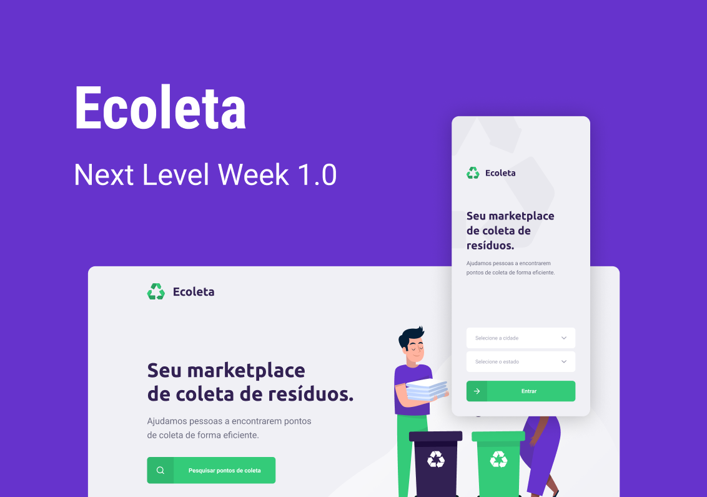
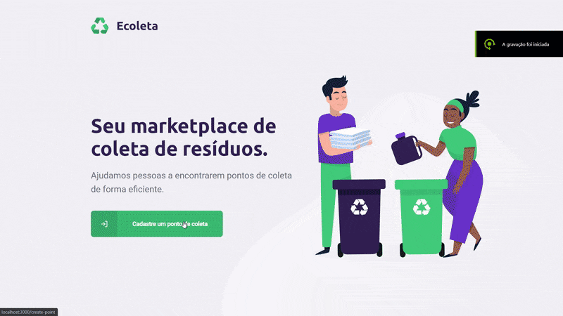
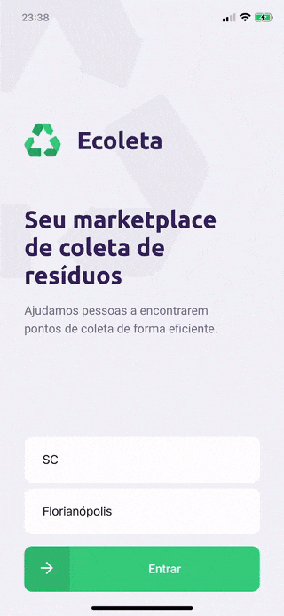

<h1 align="center">
    
</h1>

<p align="center">
  <a href="#page_facing_up-sobre">Sobre</a>&nbsp;&nbsp;&nbsp;|&nbsp;&nbsp;&nbsp;
  <a href="#computer-web">Web</a>&nbsp;&nbsp;&nbsp;|&nbsp;&nbsp;&nbsp;
  <a href="#iphone-mobile">Mobile</a>&nbsp;&nbsp;&nbsp;|&nbsp;&nbsp;&nbsp;
  <a href="#rocket-tecnologias-utilizadas">Tecnologias Utilizadas</a>&nbsp;&nbsp;&nbsp;|&nbsp;&nbsp;&nbsp;
  <a href="#gear-como-configurar-e-executar">Como configurar e executar</a>&nbsp;&nbsp;&nbsp;|&nbsp;&nbsp;&nbsp;
  <a href="#punch-contribuição">Contribuição</a>
</p>

<br/>

<p align="center">
  
  
  
  
  
  
  <a href="https://github.com/mausampaio/ecoleta/commits/master">
    
  </a>  
</p>

<br/>

<h3 align="center">
  
</h3>

<br/>


## :page_facing_up: Sobre
O Ecoleta é um marketplace de coleta de resíduos, com o objetivo de auxiliar os usuários a encontrarem pontos de descarte destes materiais, os pontos são cadastrado na interface Web e a busca é realizada pelo aplicativo Mobile, onde os pontos são mostrados no mapa. 

Esse projeto foi desenvolvido durante a Next Level Week, ministrado pela [Rocketseat](https://rocketseat.com.br/).

<br/>

## :computer: Web

<h3 align="center">
  
</h3>

<br/>

## :iphone: Mobile

<h3 align="center">
  
</h3>

<br/>

## :rocket: Tecnologias Utilizadas

- [Node.js](https://nodejs.org/en)
- [TypeScript](https://github.com/microsoft/TypeScript)
- [ReactJS](https://github.com/facebook/react)
- [React Native](https://github.com/facebook/react-native)

<br/>

## :gear: Como configurar e executar

### Pré-requisitos

  - É **necessário** possuir o **[Node.js](https://nodejs.org/en/)** instalado na máquina.
  - Também, é **preciso** ter um gerenciador de pacotes seja o **[NPM](https://www.npmjs.com/)** ou **[Yarn](https://yarnpkg.com/)**.
  - Por fim, é **essencial** ter o **[Expo](https://expo.io/)** instalado de forma global na máquina.

```bash

    # Clonar o repositório
    $ git clone https://github.com/mausampaio/ecoleta.git

    # Navegar para o diretório
    $ cd ecoleta

```
#### Back-end

- No arquivo [knexfile.ts](backend/knexfile.ts) configure os parâmetros de acesso ao banco de dados.

```bash

    # Navegar para o diretório
    $ cd backend
    
    # Instalar as dependências
    $ npm install
    
    # Executar migrations para criação das tabelas na base de dados
    $ npm run knex:migrate

    # Executar seeds para inserção de dados iniciais na base de dados
    $ npm run knex:seed

    # Iniciar o projeto
    $ npm start
    
    # Iniciar o projeto em desenvolvimento
    $ npm run dev
```

#### Web

```bash

    # Navegar para o diretório
    $ cd web
    
    # Instalar as dependências
    $ npm install

    # Iniciar o projeto
    $ npm start
    
    # Executar build
    $ npm build
```

#### Mobile

```bash

    # Navegar para o diretório
    $ cd mobile
    
    # Instalar as dependências
    $ npm install

    # Iniciar o projeto
    $ npm start
    
```

<br/>

## :punch: Contribuição

- [Diziano](https://github.com/Diziano).

---

<h4 align="center">
  Feito com :purple_heart: by <a href="https://www.linkedin.com/in/mausampaio/" target="_blank">Maurício Sampaio</a>.
</h4>